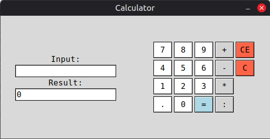

# Console and Tkinter Python Calculators

### This is my first-ever Python project. I added it to GitHub for my own benefit and to aid anyone who is starting out like I am. I hope you find this repository helpful!

## Console Calculator

This is a very simple calculator, it can only do operations with two numbers and is quite limited. It was my first project and it taught me how to use functions, loops and if-else statements.

## Tkinter Calculator



My second project put the console calculator to shame! In one simple function it does everything the console calculator can't:

```python
def calculate(event=None):
    try:
        expression = user_input.get()
        result = eval(expression)
        output.set(result)
    except:
        output.set("Error")
```

```eval()``` - Is very useful and I'll tinker with it more to make it work with NumPy. <br>
I learnt a lot about the Tkinter module, and I'll continue working on this calculator until I'm happy with it.

## Future Plans

Here's what the future holds:
 - Adding calculation history
 - Adding a currency converter using the internet to check current exchange rates
 - And probably more!

After I'm happy with this project, I'll move on to create something that is perhaps more useful. That's it for now, thank you for checking out my repository!
